## 部署Worker

 **进入Cloudflare -> Worker and Pages** 

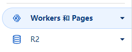

 **创建应用程序** 

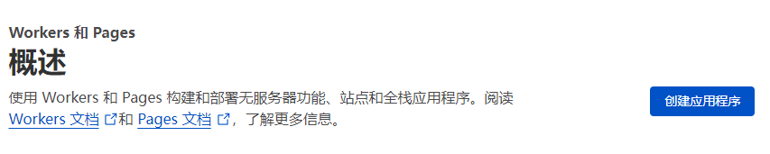

 **创建Worker** 

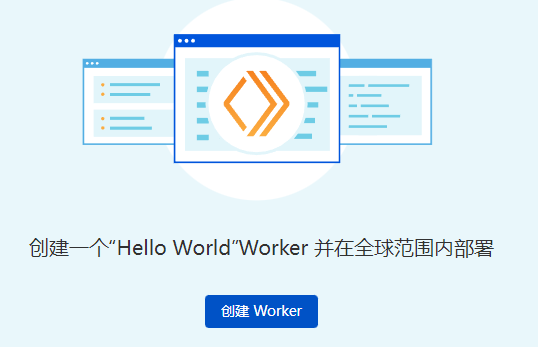

 **修改名称后点击“部署”** 

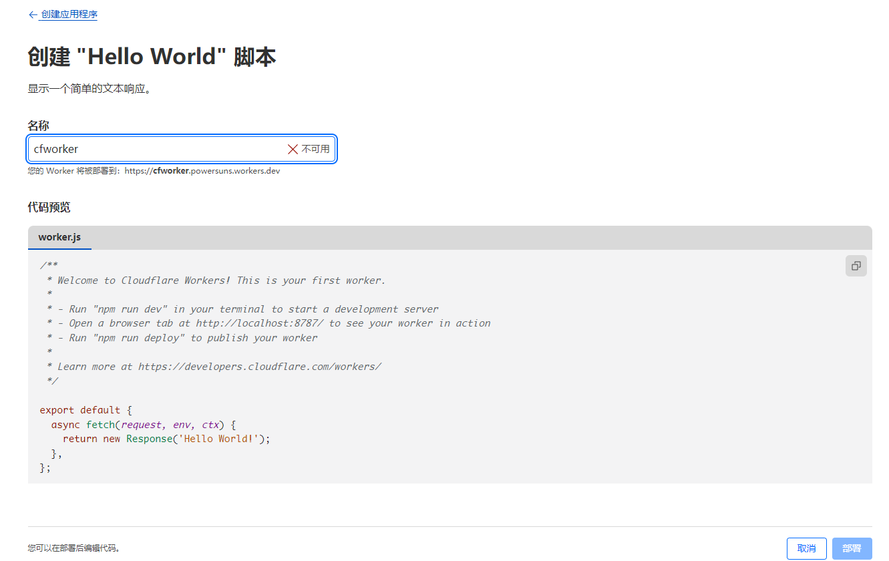

 **点击“编辑代码”** 

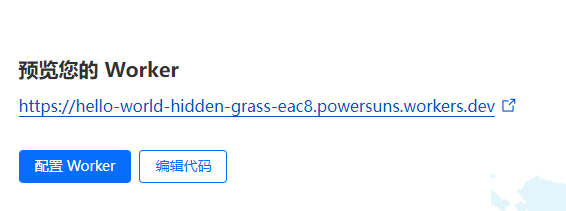

 **删除演示代码，复制下面地址中的js代码到Worker代码中** 

 https://github.com/zizifn/edgetunnel/blob/main/src/worker-vless.js

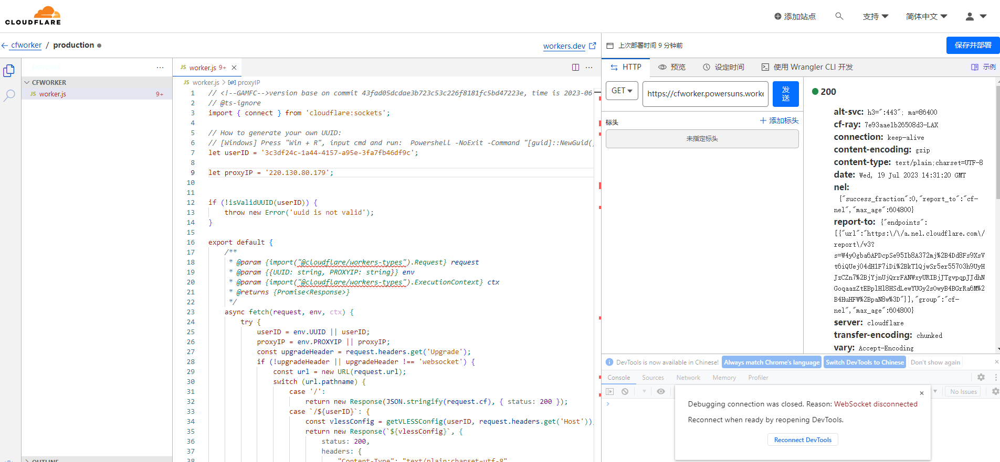

 **用v2rayN客户端生成一个Vless节点的uuid** 

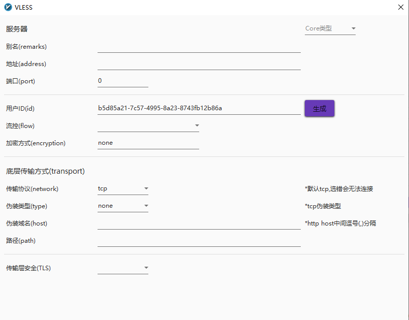

 **用生成的uuid替换Worker代码中的“let userID”** 

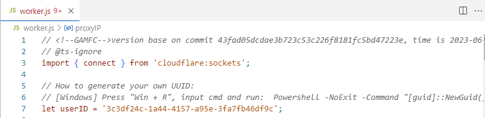

 **用cdn.anycast.eu.org填入proxyIP** 

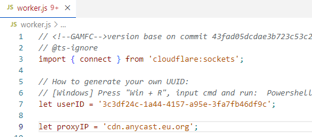

 **点击“保存并部署”** 

## 配置自定义域名

 **回到Worker页面，点击“Custome Domain”下的“查看”** 

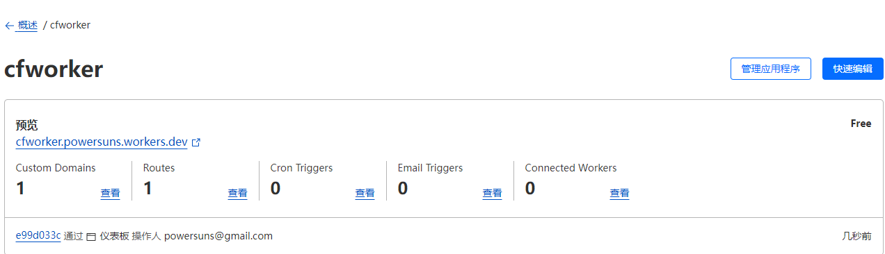

 **添加自定义域名** 

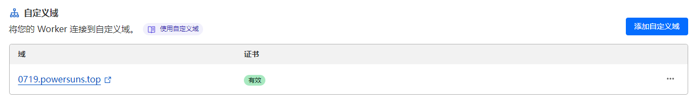

## 获取Vless节点配置

 **点击域名地址，在地址栏后加入"/<uuid>"回车，出现代理客户端配置页面** 

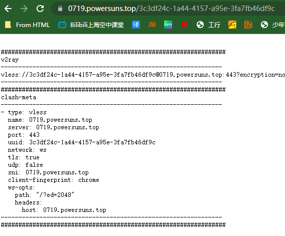

 **复制Vless链接，导入链接到v2rayN或者v2rayA** 

## 优选IP

**从下述地址下载优选工具**

https://drive.google.com/file/d/1D6i1nmCMRqXr2Dj4ySsB1xBQ4BHwzIu2/view?usp=sharing

**从zip.baipiao.eu.org下载反代优选ip整合包** 

 

**选择一个ip列表，复制其中的ip到工具主目录下的“ip.txt”中（（注意选对应端口号txt中的ip，如443；注意末尾不要有换行或者空格符）** 

 

**运行优选ip工具测试下载下来的ip地址表** 

 

**将速度最快的ip填入v2rayN或v2rayA节点配置中的地址
** 

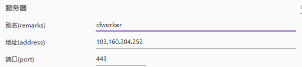

 **将另一个速度较快的ip替换worker代码中proxyIP，保存并部署** 

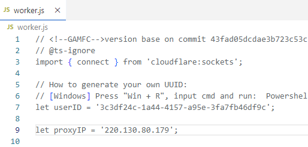

 

**注：如果只优选出一个ip，则选择一个其他地区的ip填写到worker中，保证v2rayN节点中的地址与worker proxyIP中的地址不一致** 

注：可能可以在js代码中将443替换成其他端口（注意全部替换）
